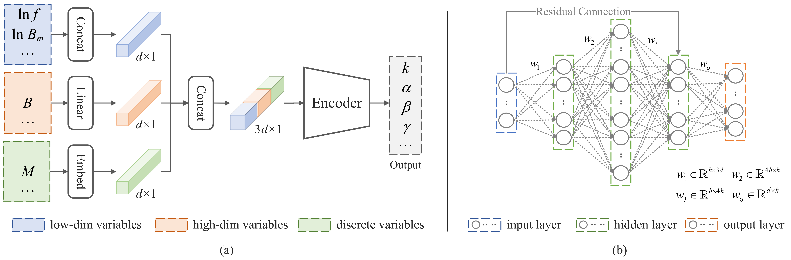

# LMSEDSRp: Data-Driven Magnetic Core Loss Modeling with Multiple Variables Crossing Materials
This is the code for our paper "[Data-Driven Magnetic Core Loss Modeling with Multiple Variables Crossing Materials](https://ieeexplore.ieee.org/document/11397825)". 

## Abstract
The generalized modeling of core loss aims to predict the power loss of magnetic components, which is crucial in fields such as electronic industry design. However, the influence relationships of operating condition variables are complex. Empirical models, such as the Steinmetz Equation, cannot fully characterise such nonlinear relationships, because the used priori equation has insufficient variables and their coefficients are all fixed. Although deep learning alleviates this issue, most existing methods still only consider limited variables and are not applicable to cross-material modeling. Therefore, we combine the prior knowledge of empirical models and the powerful fitting ability of deep learning, and propose a Deep Self-Representation (DSR) module that can either function as an independent model or be integrated into existing empirical formulas. Specifically, the integrated model can dynamically adjust the coefficients according to the input variables, resulting in better accuracy and generalization. In addition, based on the log-linear property provided by Steinmetz, we propose a flexible approach that can conveniently add more variables. To evaluate the effectiveness of the proposed method, we conducted a series of comparative and simulation experiments on the open-source dataset MagNet. The experimental results show that DSR, used alone as the core loss model, outperforms baseline methods in accuracy, with 0.875% and 1.229% errors in single-material and multi-material cases, respectively. Furthermore, the integrated model has even lower errors of 0.657% and 1.01% and better robustness. Moreover, our model can perform training and prediction on an inexpensive GPUor CPU, providing an efficient solution. 

<center class ='img'>

</center>

## Code structure

```
LMSEDSRp/
├── README.md              # Project overview and usage guide
├── Main.py                # Entry point for training
├── Datasets/              # Dataset files (NumPy format)
│   ├── Data_B.npy
│   ├── Data_C.npy
│   ├── Data_D.npy
│   ├── Data_F.npy
│   ├── Data_H.npy
│   ├── Data_M.npy
│   ├── Data_P.npy
│   └── Data_W.npy
├── Models/                # Model architecture code
│   └── ...
├── O_O/                   # Training outputs, logs, and model parameters
│   └── xx/                
│       └── Argus/         # Model parameters and coefficients
│       └── Figs/          # Training figures
└── src/                   # Supporting images and documentation
    └── DSR_and_Encoder.png
```


## Datasets
The dataset can be obtained from IEEE DataPort ([Zengrui Yi, "The processed MagNet dataset for magnetic core loss modeling", IEEE Dataport, July 28, 2025, doi:10.21227/qgyg-q357](https://ieee-dataport.org/documents/processed-magnet-dataset-magnetic-core-loss-modeling)). Download them and place them in Directory ***./Datasets***. 

Note that to obtain the original MagNet dataset, please visit MagNet (https://mag-net.princeton.edu). 

## Train
Once you have configured the environment and dataset, you can directly run ***Main.py***. Specifically, you can select models, parameters, etc. in ***Main.py***.

During the training process, you can view curves such as the Loss curve and coefficients variation curve in File ***./O_O/xx/Figs***, which are updated in real-time (every 50 Epochs). The the model parameters will be saved in ***./O_O/xx/Argus***.

## Notice
This code is a newly reorganized version, which is clearer, more concise, and easier to read compared to the original. Consequently, the results of this code slightly differ from those reported in the paper (but the difference is very minor). This is because the initialization of random seeds in various modules has changed, leading to corresponding changes in the results, as reported in our paper. Additionally, we have found that the running results may also vary slightly across different computing devices due to differences in computational precision.

If this project helps you, please give it a star.

If you are interested in our work, please cite:

````bibtex
@article{yi2026data,
  title={Data-Driven Magnetic Core Loss Modeling with Multiple Variables Crossing Materials},
  author={Yi, Zengrui and Meng, Hua and Zhou, Zhengchun},
  journal={IEEE Transactions on Power Electronics},
  year={2026},
  publisher={IEEE}
}
 ```